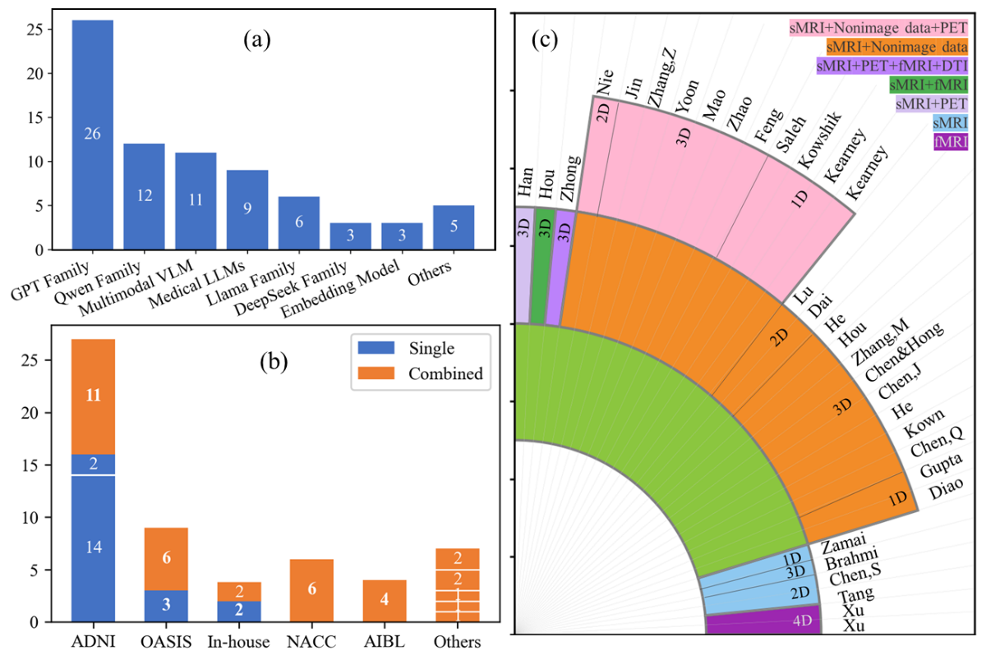

# Neuroimaging-based Alzheimer’s Disease Diagnosis Powered with Large Language Models

## 📌 Introduction
Alzheimer’s disease (AD) is a progressive and irreversible neurodegenerative disorder. Early and accurate AD diagnosis is critical for timely intervention and treatment planning. Subtle brain alterations, including cortical thinning and protein depositions, can be captured by neuroimaging well before the onset of clinical symptoms.

Computer‑aided diagnosis (CAD) can improve the speed, reliability, and precision of AD diagnosis. Recent advances in large language models (LLMs) have triggered a paradigm shift by enabling multimodal clinical data integration, interpretable diagnostic reasoning, and flexible orchestration of CAD workflows. This repository accompanies the review paper **“Neuroimaging‑based Alzheimer’s Disease Diagnosis Powered with Large Language Models”** and provides a structured collection of studies, datasets, and resources related to LLM‑powered neuroimaging‑based AD diagnosis.

## 📄 Survey

**Title:** Neuroimaging-based Alzheimer’s Disease Diagnosis Powered with Large Language Models   
**Authors:** Yan Zhao et al.  
**Institution:** University of Shanghai for Science and Technology; Beijing Normal University; The University of Sydney  
**Link:** Coming soon

## 💎 Table of Contents

  * [📌 Introduction](#-introduction)
  * [📄 Survey](#-paper)
  * [✨ Highlights](#-highlights)
  * [🏗️ Taxonomy of LLM Roles](#️-taxonomy-of-llm-roles)
  * [🗂️ Datasets](#️-datasets)
  * [🔍 General Overview](#-general-overview)
  * [📥 Citation](#-citation)

## ✨ Highlights

  * Proposes a taxonomy based on the core functional roles of LLMs within the AD‑diagnosis workflow, covering information processing, clinical reasoning, and agent orchestrator.
  * Organizes existing studies by imaging modality, input format, LLM architecture, dataset, task, and diagnostic performance.
  * Discusses the prominent technical, clinical and ethical limitations of current research, and elaborate promising future research avenues to promote the clinical translation of LLM-based AD diagnostic tools.

## 🏗️ Taxonomy of LLM Roles

The reviewed methods are grouped according to how LLMs participate in the AD diagnosis pipeline:

  * **LLM‑enabled Information Processing:** LLMs or multimodal LLMs encode neuroimaging features, clinical information, and structured biomedical data.
  * **LLM‑derived Clinical Reasoning:** LLMs generate diagnostic predictions, explanations, rationales, and disease-related inferences from multimodal evidence.
  * **LLM‑based Agent Orchestrator:** LLM-based agents coordinate specialized models, tools, datasets, and subtasks to support flexible multimodal diagnosis.


### 📖 1️⃣ LLM‑enabled Information Processing

#### Data Tokenization
* [BrainPrompt: Multi-level Brain Prompt Enhancement for Neurological Condition Identification](https://doi.org/10.1007/978-3-032-05162-2_17)
* [BrainPrompt+: Multi-Level Brain Prompt Learning for Knowledge-Guided Neurological Disorder Identification](https://doi.org/10.1109/TMI.2026.3692958)
* [Large Language Models Improve Alzheimer’s Disease Diagnosis Using Multi-Modality Data](https://doi.org/10.1109/MedAI59581.2023.00016)
* [Language-Enhanced Generative Modeling for Amyloid PET Synthesis from MRI and Blood Biomarkers](https://doi.org/10.1016/j.isci.2026.117122)
* [Schema-Adaptive Tabular Representation Learning with LLMs for Generalizable Multimodal Clinical Reasoning](https://doi.org/10.48550/arXiv.2604.11835)

#### Data Format Transformation

* [T2AgeNet: A Text-Guided Framework with Tissue Features for Brain Age Estimation](https://doi.org/10.1109/TBME.2025.3643900)
* [Clinical Dementia Rating Classification Using Integrated Vision and Language Information](https://doi.org/10.1109/ACCESS.2025.3624215)
* [Cross-modal Causal Intervention for Alzheimer’s Disease Prediction](https://doi.org/10.48550/arXiv.2507.13956)
* [Domain-adapted language model using reinforcement learning for various dementias](https://doi.org/10.64898/2026.03.17.26348154)

#### Knowledge Generation

* [HoloDx: Knowledge- and Data-Driven Multimodal Diagnosis of Alzheimer’s Disease](https://doi.org/10.1109/TMI.2025.3594364)
* [Prior-Guided Prototype Aggregation Learning for Alzheimer’s Disease Diagnosis](https://doi.org/10.1007/978-3-032-05182-0_47)


### 📖 2️⃣ LLM‑derived Clinical Reasoning

#### Neuroimage Features
 * [Enabling Few-Shot Alzheimer’s Disease Diagnosis on Biomarker Data with Tabular LLMs](https://doi.org/10.1145/3765612.3767229)
 * [Tabular LLMs for Interpretable Few-Shot Alzheimer’s Disease Prediction with Multimodal Biomedical Data](https://doi.org/10.48550/arXiv.2603.17191)
 * [BRAINS: A Retrieval-Augmented System for Alzheimer’s Detection and Monitoring](https://doi.org/10.1109/ICMLA66185.2025.00224)
 * [Beyond Classical Approaches: Fine-Tuning Clinical BERT Model on Structured Data for Alzheimer’s Disease Diagnosis](https://doi.org/10.12720/jait.16.6.854-868)
 * [An Explainable Diagnostic Framework for Neurodegenerative Dementias via Reinforcement-Optimized LLM Reasoning](https://doi.org/10.48550/arXiv.2505.19954)

#### 2D Slice
 * [Vision-Language Model for Enhanced MCI Identification In Alzheimer’s Disease through Neuropsychological and Neuroimaging Data Integration](https://doi.org/10.1016/j.neunet.2025.108415)
 * [Data-Driven Analysis of Alzheimer’s Disease Classification Using LLaVA-Med: A Large Language Model Approach](https://doi.org/10.1109/AICCSA63423.2024.10912607)
 * [Why Text Prevails: Vision May Undermine Multimodal Medical Decision Making](
https://doi.org/10.48550/arXiv.2512.13747)


#### 3D Scan
 * [FLIQA-AD: A Fusion Model with Large Language Model for Better Diagnose and MMSE Prediction of Alzheimer’s Disease](https://doi.org/10.18653/v1/2025.naacl-short.49)
 * [Large Language Models Are Clinical Reasoners: Reasoning-Aware Diagnosis Framework with Prompt-Generated Rationales](https://doi.org/10.1609/aaai.v38i16.29802)
 * [NeuroSymAD: A Neuro-Symbolic Framework for Interpretable Alzheimer’s Disease Diagnosis](
https://doi.org/10.48550/arXiv.2503.00510)
 * [MedBLIP: Bootstrapping Language-Image Pretraining from 3D Medical Images and Texts](https://doi.org/10.1007/978-981-96-0908-6_6)
 * [R-GenIMA: Integrating Neuroimaging and Genetics with Interpretable Multimodal AI for Alzheimer’s Disease Progression](https://doi.org/10.48550/arXiv.2512.18986)

#### Neuroimage Features & 3D Scan
 * [Diffusion with a Linguistic Compass: Steering the Generation of Clinically Plausible Future sMRI Representations for Early MCI Conversion Prediction](https://openreview.net/forum?id=CVY9W5KFR2#)

### 📖 3️⃣ LLM‑based Agent Orchestrator

#### Specific Agents for AD Diagnosis
  * [ADAgent: LLM-based Agent for Alzheimer’s Disease Analysis](https://doi.org/10.1007/978-3-032-06004-4_3)
  * [LAMA-AD: Label-Aware Multi-Agent Alzheimer’s Disease Diagnosis with Counterfactual Reasoning](https://doi.org/10.1109/BIBM66473.2025.11356944)
  * [A Large Language Model-Based Self-Learning and Critical Agent Framework for Multimodal Alzheimer’s Disease Diagnosis](https://doi.org/10.1037/neu0001079)
  * [AD-CARE: A Guideline-grounded, Modality-agnostic LLM Agent for Real-world Alzheimer’s Disease Diagnosis with Multi-cohort Assessment, Fairness Analysis, and Reader Study](
https://doi.org/10.48550/arXiv.2603.25322)
#### General‑Purpose Agents Capable of AD Diagnosis
  * [Towards a Virtual Neuroscientist: Autonomous Neuroimaging Analysis via Multi-Agent Collaboration](https://doi.org/10.48550/arXiv.2605.09366)
  * [NeuroAgent: LLM Agents for Multimodal Neuroimaging Analysis and Research](https://doi.org/10.48550/arXiv.2605.06584)
  * [MedOrch: Medical Diagnosis with Tool-Augmented Reasoning Agents for Flexible Extensibility](
https://doi.org/10.48550/arXiv.2506.00235)

## 🗂️ Datasets

### Public Datasets

  * [Alzheimer’s Disease Neuroimaging Initiative (ADNI)](http://adni.loni.usc.edu/)
  * [Quantitative Templates for the Progression of AD (QT-PAD)](https://www.pi4cs.org/qt-pad-challenge)
  * [Open Access Series of Imaging Studies (OASIS)](https://sites.wustl.edu/oasisbrains/)
  * [Australian Imaging, Biomarker & Lifestyle (AIBL)](https://aibl.org.au/)
  * [National Alzheimer’s Coordinating Center (NACC)](https://www.naccdata.org/)
  * [Minimal Interval Resonance Imaging in Alzheimer’s Disease (MIRIAD)](https://www.ucl.ac.uk/brain-sciences/ion/research/research-centres/dementia-research-centre/research-clinical-trials/minimal-interval-resonance-imaging-alzheimers-disease-miriad)
  * [Alzheimer’s Brain MRI (AB-MRI)](https://www.kaggle.com/datasets/preetpalsingh25/alzheimers-dataset-4-class-of-images)
  * [Latin American Brain Health Institute (BrainLat)](https://brainlat.uai.cl/)
  * [Neuroimaging Initiative for Frontotemporal Lobar Degeneration(NIFD)](https://ida.loni.usc.edu/collaboration/access/appLicense.jsp#:~:text=NIFD%20is%20the%20nickname%20for%20the%20frontotemporal%20lobar,characterize%20longitudinal%20clinical%20and%20imaging%20changes%20in%20FTLD.)
  * [Parkinson’s Progression Markers Initiative (PPMI)](https://www.ppmi-info.org/access-data-specimens/download-data/)

### Private Datasets

  * XWH & SYSUH
  * Huashan & Sixth People’s Hospital
  * BRAINS-Data
  * RENJI
## 🔍 General Overview


*Summary of the association of included articles with year (left), corresponding‑author country (middle), and functional roles of LLMs (right) in AD diagnosis workflow.


*Statistical analysis of the included articles,(a) Distribution of employed LLMs; (b) Distribution of adopted datasets; (c) Distribution of adopted data modalities and MRI dimensionality across the 32 included studies.


## 📥 Citation

The citation information will be updated after publication.

```bibtex
Coming soon
```


