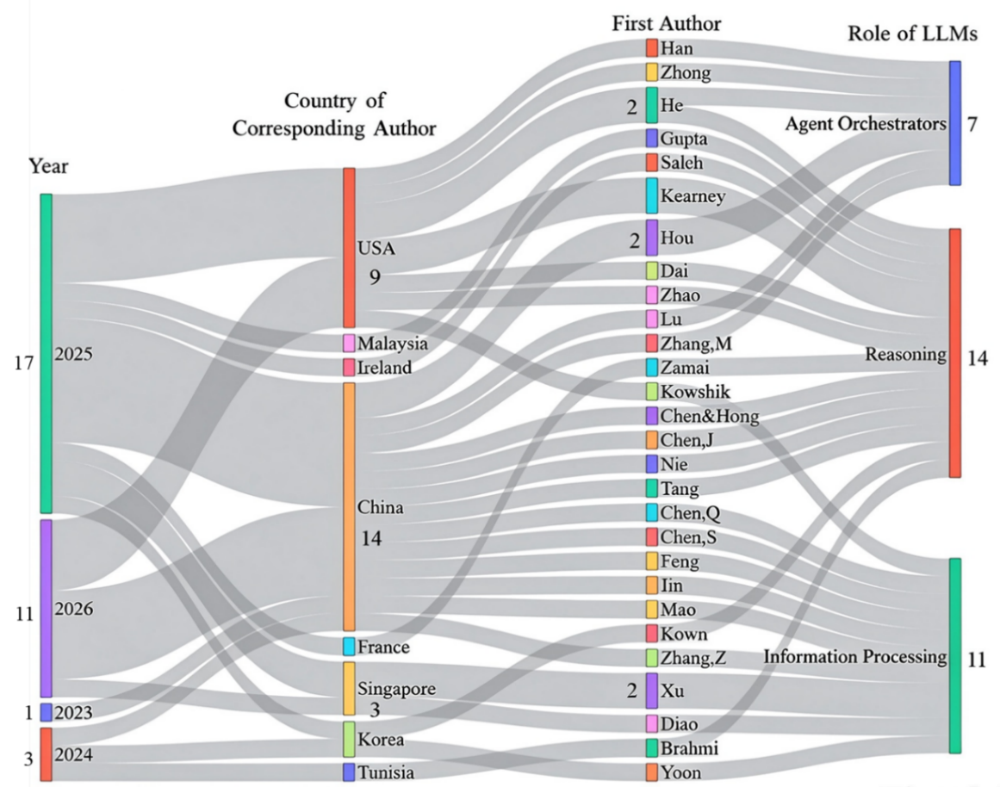

# Neuroimaging-based Alzheimer’s Disease Diagnosis Powered with Large Language Models

## 📌 Introduction
Alzheimer’s disease (AD) is a progressive and irreversible neurodegenerative disorder. Early and accurate AD diagnosis is critical for timely intervention and treatment planning. Subtle brain alterations, including cortical thinning and protein depositions, can be captured by neuroimaging well before the onset of clinical symptoms.

Computer‑aided diagnosis (CAD) can improve the speed, reliability, and precision of AD diagnosis. Recent advances in large language models (LLMs) have triggered a paradigm shift by enabling multimodal clinical data integration, interpretable diagnostic reasoning, and flexible orchestration of CAD workflows. This repository accompanies the review paper **“Neuroimaging‑based Alzheimer’s Disease Diagnosis Powered with Large Language Models”** and provides a structured collection of studies, datasets, and resources related to LLM‑powered neuroimaging‑based AD diagnosis.

## 📄 Survey

**Title:** Neuroimaging-based Alzheimer’s Disease Diagnosis Powered with Large Language Models   
**Authors:** Yan Zhao et al.  
**Institution:** University of Shanghai for Science and Technology; Beijing Normal University; The University of Sydney  
**Link:** Coming soon

## 💎 Table of Contents

  * [📌 Introduction](#-introduction)
  * [📄 Survey](#-paper)
  * [✨ Highlights](#-highlights)
  * [🏗️ Taxonomy of LLM Roles](#️-taxonomy-of-llm-roles)
  * [🗂️ Datasets](#️-datasets)
  * [🔍 General Overview](#-general-overview)
  * [📥 Citation](#-citation)

## ✨ Highlights

  * Proposes a taxonomy based on the core functional roles of LLMs within the AD‑diagnosis workflow, covering information processing, clinical reasoning, and agent orchestrator.
  * Organizes existing studies by imaging modality, input format, LLM architecture, dataset, task, and diagnostic performance.
  * Discusses the prominent technical, clinical and ethical limitations of current research, and elaborate promising future research avenues to promote the clinical translation of LLM-based AD diagnostic tools.

## 🏗️ Taxonomy of LLM Roles

The reviewed methods are grouped according to how LLMs participate in the AD diagnosis pipeline:

  * **LLM‑enabled Information Processing:** LLMs or multimodal LLMs encode neuroimaging features, clinical information, and structured biomedical data.
  * **LLM‑derived Clinical Reasoning:** LLMs generate diagnostic predictions, explanations, rationales, and disease-related inferences from multimodal evidence.
  * **LLM‑based Agent Orchestrator:** LLM-based agents coordinate specialized models, tools, datasets, and subtasks to support flexible multimodal diagnosis.


###📖 1️⃣ Information Processing

  * [BrainPrompt: Multi-Level Brain Prompt Enhancement for Neurological Condition Identification]()
  * [Clinical Dementia Rating Classification Using Integrated Vision and Language Information]()
  * [Large Language Models Improve Alzheimer’s Disease Diagnosis Using Multi-Modality Data]()
  * [Schema-Adaptive Tabular Representation Learning with LLMs for Generalizable Multimodal Clinical Reasoning]()
  * [Diffusion with a Linguistic Compass: Steering the Generation of Clinically Plausible Future sMRI Representations for Early MCI Conversion Prediction]()

###📖 2️⃣ Clinical Reasoning

  * [Large Language Models Are Clinical Reasoners: Reasoning-Aware Diagnosis Framework with Prompt-Generated Rationales]()
  * [A Vision-Language Model for Enhanced MCI Identification in Alzheimer’s Disease through Neuropsychological and Neuroimaging Data Integration]()
  * [FLIQA-AD: A Fusion Model with Large Language Model for Better Diagnose and MMSE Prediction of Alzheimer’s Disease]()
  * [An Explainable Diagnostic Framework for Neurodegenerative Dementias via Reinforcement-Optimized LLM Reasoning]()
  * [NeuroSymAD: A Neuro-Symbolic Framework for Interpretable Alzheimer’s Disease Diagnosis]()
  * [Tabular LLMs for Interpretable Few-Shot Alzheimer’s Disease Prediction with Multimodal Biomedical Data]()

###📖 3️⃣ Agent Orchestrator

  * [ADAgent: LLM-based Agent for Alzheimer’s Disease Analysis](https://link.springer.com/chapter/10.1007/978-3-032-06004-4_3)
  * [Medical Diagnosis with Tool-Augmented Reasoning Agents for Flexible Extensibility]()
  * [A Large Language Model-Based Self-Learning and Critical Agent Framework for Multimodal Alzheimer’s Disease Diagnosis]()
  * [NeuroAgent: LLM Agents for Multimodal Neuroimaging Analysis and Research]()
  * [Towards a Virtual Neuroscientist: Autonomous Neuroimaging Analysis via Multi-Agent Collaboration]()

## 🗂️ Datasets

### Public Datasets

  * [Alzheimer’s Disease Neuroimaging Initiative (ADNI)](http://adni.loni.usc.edu/)
  * [Quantitative Templates for the Progression of AD (QT-PAD)](https://www.pi4cs.org/qt-pad-challenge)
  * [Open Access Series of Imaging Studies (OASIS)](https://sites.wustl.edu/oasisbrains/)
  * [Australian Imaging, Biomarker & Lifestyle (AIBL)](https://aibl.org.au/)
  * [National Alzheimer’s Coordinating Center (NACC)](https://www.naccdata.org/)
  * [Minimal Interval Resonance Imaging in Alzheimer’s Disease (MIRIAD)](https://www.ucl.ac.uk/brain-sciences/ion/research/research-centres/dementia-research-centre/research-clinical-trials/minimal-interval-resonance-imaging-alzheimers-disease-miriad)
  * [Alzheimer’s Brain MRI (AB-MRI)](https://www.kaggle.com/datasets/preetpalsingh25/alzheimers-dataset-4-class-of-images)
  * [Latin American Brain Health Institute (BrainLat)](https://brainlat.uai.cl/)
  * [Neuroimaging Initiative for Frontotemporal Lobar Degeneration(NIFD)](https://ida.loni.usc.edu/collaboration/access/appLicense.jsp#:~:text=NIFD%20is%20the%20nickname%20for%20the%20frontotemporal%20lobar,characterize%20longitudinal%20clinical%20and%20imaging%20changes%20in%20FTLD.)
  * [Parkinson’s Progression Markers Initiative (PPMI)](https://www.ppmi-info.org/access-data-specimens/download-data/)

### Private Datasets

  * XWH & SYSUH
  * Huashan & Sixth People’s Hospital
  * BRAINS-Data
  * RENJI
## 🔍 General Overview





## 📥 Citation

The citation information will be updated after publication.

```bibtex
Coming soon
```


